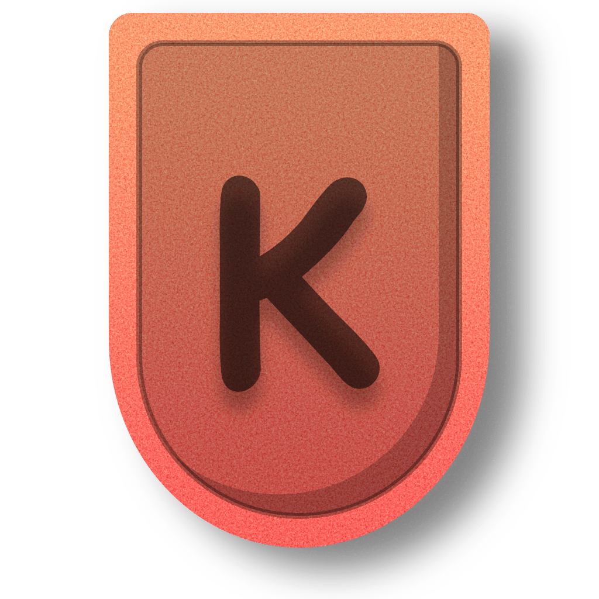

<!--<div align="center">
  <a href="https://github.com/crazyh2">
	 
  </a>
</div>-->

> **NOTE**
>
> This is just a steno engine library and it does NOT work on its own. Please use something else such as Plover or wait for my full steno engine. Huge thanks to the openstenoproject for all their amazing work!

<div align="center">
  <a href="https://github.com/crazyh2">
	 
  </a>
</div>

<!--<h3 align="center">Kestrel.js</h3>-->
<h4 align="center">A stenography library that anyone can use and contribute to! Took 4 days to complete first version. <br>Made By <a href="https://github.com/crazyh2/">CrazyH2</a></h4>
<h4 align="center">TAKE A LOOK AT PLOVER AND PLOVERPAD AS THIS WOULDN'T BE POSSIBLE WITHOUT THEM!<br>THE IMPLIMENTATION OF RTF/CTE ON PLOVERPAD IS USED FOR KESTRAL.JS<br><a href="http://openstenoproject.org/plover/">Plover</a>  |  <a href="https://www.openstenoproject.org/ploverpad/ploverpad.html">Ploverpad</a></h4>

<h2 align="left">Installation</h2>
- Download src code from the repo or go to Releases tab for all the versions.
- Install packages and dependencies.
sh```
npm install
```
- Reference in your code and Kestrel.js will do all the steno engine stuff for you.

<h2 align="left">Production Compiling</h2>
`THIS HAS NOT YET BEEN ADDED!`

<h2 align="left">Usage</h2>
js```
const { GlobalKeyboardListener } = require("node-global-key-listener");

const Kestrel = require("../lib/engine");
const Dictionary = require("../assets/dict.json");

(async () => {
    const app = await Kestrel();

    var gkl = new GlobalKeyboardListener();
    gkl.addListener((e, down) => {
        if(!e.name.includes("MOUSE")) app.input.fromQwerty(e.state == 'DOWN', e.name);
    });

    await app.output.onData((data) => {
        console.log(data);
    });

    await app.dictionaries.load(Dictionary);
})();
```

<br>

<h2 align="left">Contributing</h2>
All contributions will be looked at and most likely accepted when I have time to look at them. Please make sure what you contribute actually applies to the project, and if not see if it would work elsewhere. For example <a href="http://openstenoproject.org/plover/">Plover</a>.

<h2 align="left">Dictionaries</h2>
We support most dictionaries that will work with <a href="http://openstenoproject.org/plover/">Plover</a> and other steno engines, so just import one you used to or learn one. Just make sure the file is in the format <a href="https://en.wikipedia.org/wiki/JSON">JSON</a> otherwise the dictionary won't work with Kestrel.js. I personally recommend <a href="http://lapwing.aerick.ca">lapwing thory</a> which you can learn online for free.

<h2 align="left">Making Addons</h2>
Ask for help or look at the source code when your stuck!

Example:
js```
class AddonExample {
    constructor(convert) {
        this.isAddon = true;
        this.convert = convert;
    };

    onLoad() {

    };

    onUnload() {

    };

    onKeyDown(key) {

    };

    onKeyUp(key) {

    };

    async onChord(chord, output, next) {
        return next(); // Skip this addon
    };
};

module.exports = { AddonExample };
```

<h2 align="left">Macros</h2>
Just ask if the code confuses you!

Example:
js```
const MacroExample = {
    "{CAPS-LOCK:ON}": (output) => {

        output.sendModify([
          { action: 'delete', amount: 5 },
          { action: 'add', text: "hello" }
        ]);

    }
}

module.exports = { MacroExample };
```

<br>

<h2 align="left">License</h2>
Distributed under a Custom License. See `LICENSE` for more information.

<h2 align="left">Credits</h2>
<b>- Huge thanks to Openstenoproject an the steno community for allowing this project to exist.<br></b>
<b>- Main Dev: CrazyH2</b>

<div align="center">
  <a href="https://github.com/crazyh2">
	 
  </a>
</div>